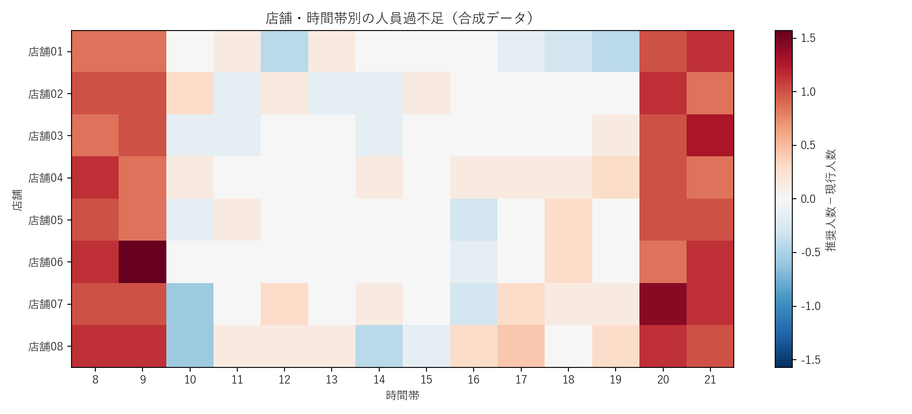
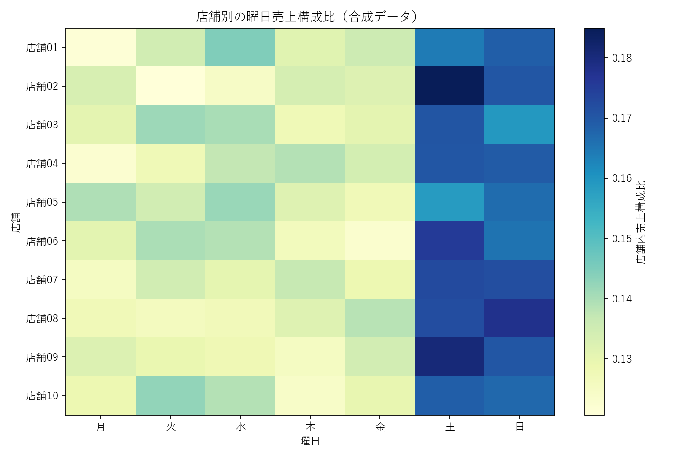
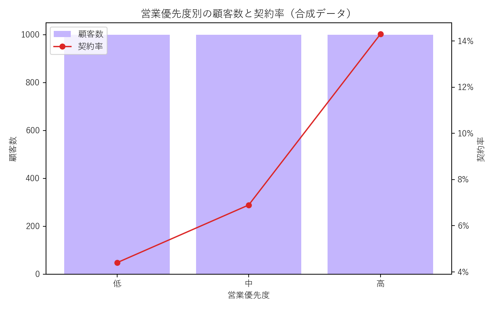
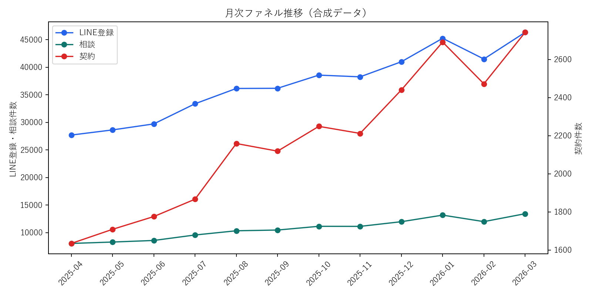

# 事業データ分析ポートフォリオ

事業課題を起点に、データ整備、SQL・Pythonによる分析、可視化、施策設計までを4つのプロジェクトとしてまとめています。

分析コードと出力結果は、実在企業の情報を含まない合成データで再現しています。数値は分析手順を説明するためのデモ結果であり、実案件の数値ではありません。

## 分析プロジェクト

| プロジェクト | 解いた課題 | 主な分析 |
| --- | --- | --- |
| [スーパーのシフト最適化](projects/01_shift_optimization/README.md) | 来店需要と業務量に応じた適正人員の配置 | 業務名の名寄せ、工程時間集計、時間帯別需要予測、人員過不足分析 |
| [スーパーのID・POS分析](projects/02_idpos_analysis/README.md) | 顧客・商品・店舗の特徴を踏まえたチラシ商品の選定 | RFM、ABC、曜日・店舗比較、併買、買い回り、販促候補スコア |
| [専門商社の営業最適化](projects/03_sales_optimization/README.md) | 営業対象の優先順位付けと対応の標準化 | 顧客セグメント、見込みスコア、商談化率・契約率分析 |
| [CRM構築とファネル改善](projects/04_crm_analytics/README.md) | 広告流入から契約までの一元把握 | データマート設計、ファネル、流入別CVR、CPA、回帰分析 |

## 担当領域

各案件で、事業課題の整理、データ確認・加工、分析設計、実装、可視化、示唆整理までを担当しました。分析結果をレポートで終わらせず、シフト作成、チラシ選定、営業リスト、CRM運用など現場の意思決定へ接続することを重視しています。

## 可視化サマリー

各プロジェクトでは、全体傾向だけでなく、時間帯・店舗・顧客・商品・流入経路・施策効率など複数の切り口で分析しています。

| シフト最適化 | ID・POS分析 |
| --- | --- |
|  |  |
| 営業最適化 | CRM・ファネル分析 |
|  |  |

## SQLによる分析用データ作成

各プロジェクトの `sql/` に、合成データをBigQueryへ読み込んだ想定のStandard SQLを掲載しています。単独テーブルの集計例ではなく、複数テーブルから分析用データマートを作成する処理です。

| SQLスキル | 掲載例 |
| --- | --- |
| `JOIN` | POS明細と商品マスタ、顧客・活動・商談、広告・LINE・商談データの結合 |
| `GROUP BY` | 店舗・曜日・時間帯、顧客・商品・チャネル単位のKPI集計 |
| `UNION ALL` | 業務名マスタの作成、複数CRMソースのイベント統合 |
| サブクエリ・CTE | 名寄せ、前処理、段階的な指標算出、分析対象の絞り込み |
| ウィンドウ関数 | 移動平均、RFM五分位、ABC累積構成比、顧客内の最新活動抽出 |
| 実務向け処理 | `SAFE_DIVIDE`、`COALESCE`、`CASE`、`QUALIFY`、日付関数 |

## 実行方法

```bash
python -m venv .venv
pip install -r requirements.txt

python projects/01_shift_optimization/generate_demo_data.py
python projects/01_shift_optimization/analyze.py
```

他の案件も同様に、各ディレクトリの `generate_demo_data.py`、`analyze.py` の順に実行できます。

## 公開方針

- 企業名、顧客名、個人情報、実データ、固有の業務ロジックは掲載していません。
- 実務背景と担当範囲は匿名化して記載しています。
- データ、グラフ、分析値はすべてデモ用の合成値です。

