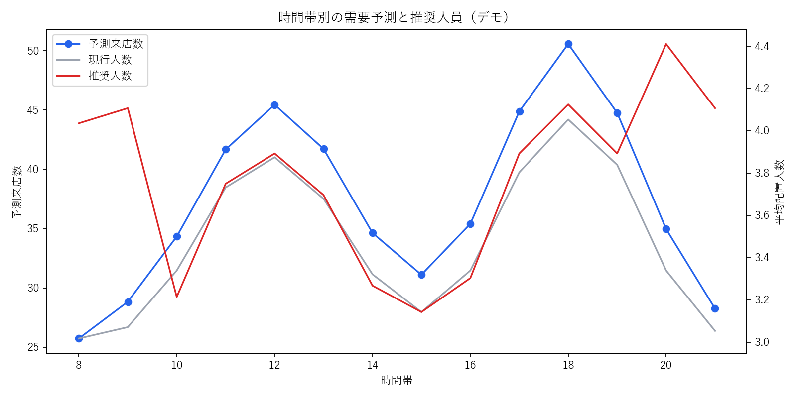

# スーパーのシフト最適化プロジェクト

## 背景

複数店舗を展開するスーパーでは、品出し、レジ、惣菜、清掃など多様な業務があり、必要な作業量は店舗規模・曜日・時間帯によって変わります。一方、店舗ごとに同じ業務を異なる名称で記録していたため、全店横断で業務時間を比較できず、経験中心のシフト作成になっていました。

売上から来店需要が高まる時間帯を推定し、固定業務と来店数に連動する業務を合わせて必要人数を算出することで、過不足の少ないシフトを設計することが課題でした。

## 担当範囲

プロジェクトメンバーとして、分析業務全般を担当しました。

- 店舗別・業務工程別の作業時間集計
- 店舗ごとに異なる業務名の名寄せ
- 売上と時間帯から来店需要を推定するモデル設計
- 工程別の標準作業時間の算出
- 時間帯別の必要人数と現行人数の過不足分析
- 店舗運用で利用できるシフト案への変換

## 分析設計

1. 表記ゆれを「レジ」「品出し」「惣菜」「清掃」「発注・在庫」の標準業務へ統合
2. 店舗・標準業務ごとに作業時間の中央値を算出し、外れ値の影響を抑制
3. 曜日・時間帯別の売上傾向から、翌週の来店需要指数を推定
4. 固定作業時間と、需要に比例する作業時間を合算
5. 稼働率を考慮して必要人数へ換算し、現行配置との差分を可視化

## デモ分析で確認できること

- 店舗固有の業務名を共通分類へ名寄せした結果
- 曜日・時間帯別の需要予測
- 店舗・時間帯別の推奨人数
- 人員不足・余剰が起きやすい時間帯
- 推奨配置へ変更した場合の過不足時間の変化

## 意思決定への接続

需要のピークだけでなく、開店前準備や閉店作業など固定業務も分けて扱います。モデルの人数をそのまま確定値にはせず、スキル、雇用条件、休憩、最低配置人数などの制約を加え、店長が調整可能なシフト案として提示します。

## デモ分析結果

- 店舗別の表記を5つの標準業務へ名寄せ
- 店舗・曜日・時間帯別に784区分の推奨人数を算出
- 現行配置に対して、人員不足257区分、余剰41区分を検出
- 昼・夕方の需要ピークに加え、開店・閉店時の固定業務を反映

この結果から、全時間帯の人数を一律に増減するのではなく、夕方ピークと閉店業務が重なる時間帯へ人員を移すシフト案を検討します。

## ファイル

- `generate_demo_data.py`: 8店舗・8週間分の合成データを生成
- `analyze.py`: 名寄せ、需要予測、必要人数算出、可視化
- `sql/shift_staffing_mart.sql`: 工程・売上・シフトを結合した推奨人員データマート
- `data/`: 合成した工程実績・時間帯別売上・現行シフト
- `outputs/`: 名寄せ結果、推奨人員、過不足分析、グラフ

## 使用技術

`BigQuery SQL` `Python` `pandas` `NumPy` `需要予測` `数理最適化の前処理` `業務工程分析`

> 実務内容は匿名化しています。データ、店舗名、業務名、分析値は説明用に生成したものです。

