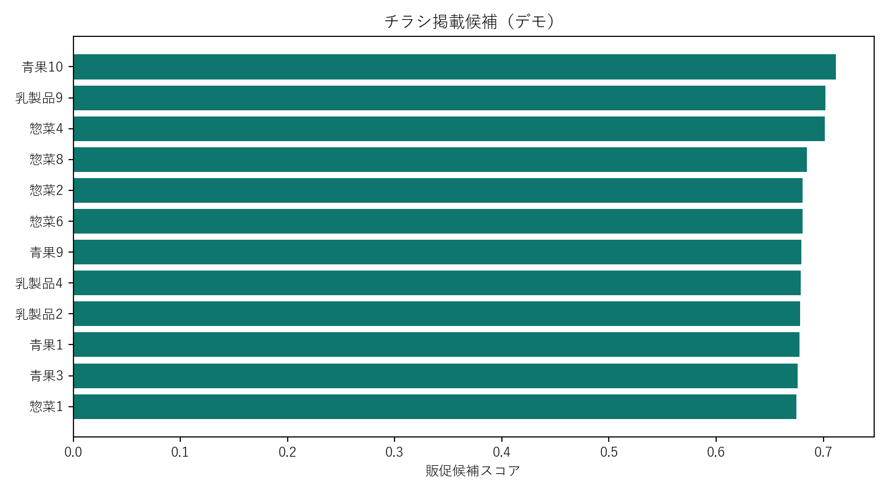

# スーパーのID・POS分析プロジェクト

## 背景

商社を母体とするスーパーマーケット事業で、約10店舗・2年以上のID・POSデータを活用し、チラシへ掲載する商品や販促対象をデータに基づいて選定することが課題でした。

単純な売上上位商品だけでは、既に自然に売れている定番商品へ販促が偏ります。そこで、顧客構造、店舗特性、曜日、購買頻度、併買・買い回りまで確認し、「誰に、どの商品を、どの店舗・時期で訴求するか」を判断できる分析を行いました。

## 担当範囲

- 顧客・商品・店舗・日付を軸としたID・POSデータの整形
- 売上、客数、客単価、買上点数、購買頻度の基礎分析
- RFM分析と顧客セグメント設計
- 商品ABC分析、カテゴリ構成、価格帯分析
- 曜日別、店舗別、期間比較、季節性の分析
- 併買分析と複数店舗・売場を横断する買い回り分析
- チラシ掲載商品の候補抽出
- 利用者が条件を切り替えられるBIレポートの構築

## チラシ商品の選定方針

チラシ候補は売上だけでなく、次の観点を組み合わせて評価します。

- 顧客到達率：何人の顧客が購入しているか
- 購買頻度：繰り返し購入されるか
- 併買波及：他カテゴリの購入につながるか
- 店舗適合度：対象店舗で相対的に支持されているか
- 曜日適合度：販促日の購買傾向と合うか
- 伸長余地：認知拡大によって購入者増加が見込めるか

## デモ分析で確認できること

- 顧客別RFMセグメント
- 商品別ABCランク
- 店舗・曜日別の売上特性
- 商品ペアの併買支持度・信頼度・リフト値
- 複数店舗利用者の構成
- チラシ掲載候補ランキング

## 意思決定への接続

全店共通の商品だけでなく、店舗商圏や曜日特性に応じた候補を分けます。また、販売後は対象商品の売上だけでなく、購入者数、併買額、再来店率まで確認し、次回の選定ルールへ反映します。

## デモ分析結果

- 2,000人の顧客をRFMで「優良」「一般」「休眠・育成」へ分類
- 複数店舗を利用する顧客は25.1%で、買い回りを考慮する必要性を確認
- 80商品をABC評価し、売上構成と顧客到達率を比較
- 商品ペアの支持度・信頼度・リフト値から併買関係を抽出
- 顧客到達率、反復購買、併買波及、伸長余地を合成し、チラシ候補を順位付け

候補商品は、全店一律ではなく店舗・曜日ごとに再評価し、施策後の併買額と再来店率まで検証します。

## ファイル

- `generate_demo_data.py`: 10店舗・約1年分の合成ID・POSを生成
- `analyze.py`: RFM、ABC、店舗・曜日、併買、チラシ候補を分析
- `data/`: 合成した取引明細・商品マスタ
- `outputs/`: 顧客区分、商品評価、販促候補、グラフ

## 使用技術

`SQL` `Python` `pandas` `ID・POS分析` `RFM分析` `ABC分析` `併買分析` `BI`

> 企業名、商品名、実データは掲載していません。分析値は説明用の合成データによるものです。

