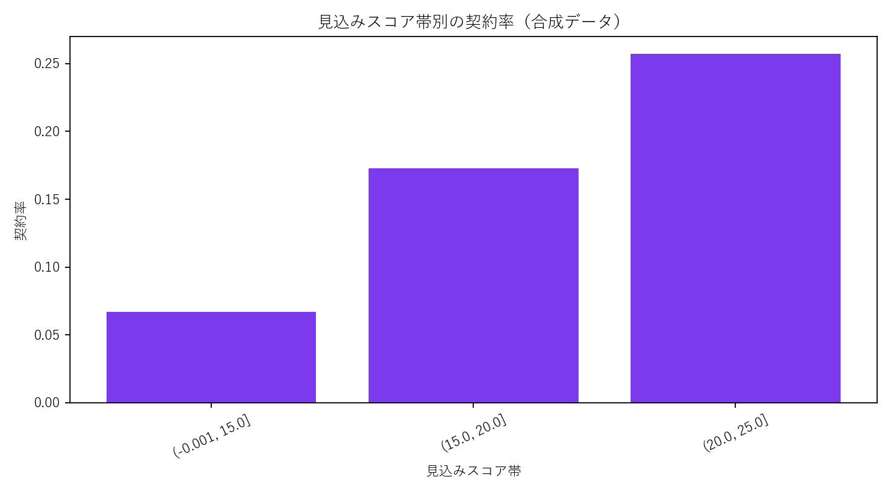

# 専門商社の営業最適化プロジェクト

## 背景

原料を扱う専門商社では、Salesforceにリード、顧客、商談、営業活動、受注・失注の履歴が蓄積されていました。一方、入力・案件管理が中心で、どの顧客から優先して対応すべきか、顧客属性に応じて何を行うべきかという営業判断には十分活用されていませんでした。

担当者の経験を尊重しながら、過去の営業結果から見込み度を定量化し、限られた営業工数を確度の高い顧客へ配分できる仕組みが求められていました。

## 担当範囲

- Salesforce内のリード、顧客、商談、活動、受注・失注データの整理
- 欠損、重複、ステータス定義の確認
- 顧客属性と過去結果によるセグメント設計
- 営業用の対象顧客リスト作成
- 顧客ごとの見込みスコア算出
- 優先度と次の対応内容をSalesforceへ反映
- 営業結果に基づくスコア・ルールの継続改善

## 分析設計

1. 商談化・契約に至るまでのファネルを定義
2. 業種、企業規模、問い合わせ種別、流入経路、接触回数などを説明変数として整理
3. 各特徴と商談化率・契約率の関係を確認
4. 過去結果に基づく見込みスコアを算出
5. スコアだけでなく、未対応期間や担当可能件数を加えて営業優先順位を作成
6. 優先度別の推奨対応をSalesforce上の運用へ接続

## デモ分析で確認できること

- 顧客属性・流入経路別の契約率
- 営業接触回数と商談化率の関係
- 顧客ごとの見込みスコア
- 優先顧客リストと推奨アクション
- スコア帯別の契約率による妥当性確認

## 実務での成果

- 担当者の感覚だけでなく、データに基づいて営業対象を選定できる状態を構築
- 見込み度に応じた対応を標準化・自動化
- 契約率を約10%から約20%へ改善

## 意思決定への接続

分析レポートだけで終わらせず、Salesforce上の顧客リスト、見込みスコア、次回対応へ反映しました。スコアは営業担当者を評価するためではなく、優先順位を支援する情報として扱い、結果を定期的に再学習・見直しする運用にしました。

## デモ分析結果

- 3,000件の営業データから、顧客属性と活動状況に基づく見込みスコアを算出
- 全体契約率8.5%に対し、高優先度群では14.3%を確認
- 未契約顧客から優先対応300件を抽出
- 「優先フォロー」「商談状況を確認」「初回接触」「定期情報提供」の推奨対応を付与

実務では、営業結果を定期的に取り込み、特定属性への過度な依存やスコアの劣化を確認しながら閾値を更新します。

## ファイル

- `generate_demo_data.py`: 顧客属性・活動・商談結果の合成データを生成
- `analyze.py`: セグメント、見込みスコア、優先顧客を分析
- `sql/sales_priority_mart.sql`: 顧客・活動・商談を結合した営業優先リストを作成
- `data/`: 合成した営業データ
- `outputs/`: 優先顧客、スコア検証、グラフ

## 使用技術

`Salesforce` `BigQuery SQL` `Python` `Looker Studio` `営業データ分析`

> 商材の詳細、企業名、顧客名、実データ、固有のスコアロジックは掲載していません。

