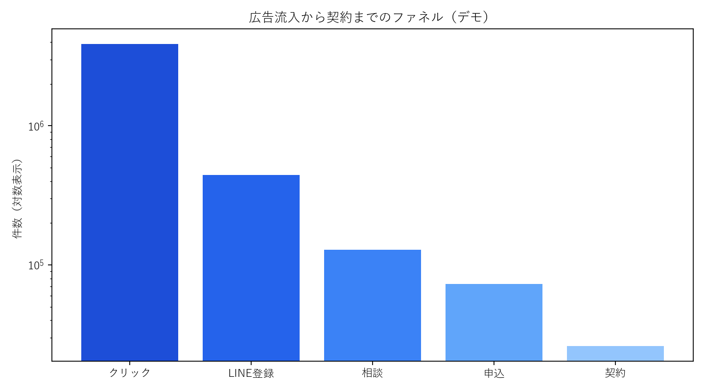

# CRM構築とファネル改善プロジェクト

## 背景

広告実績、Lステップ上のLINE顧客行動、Notion上の商談・契約状況が別々に管理されており、広告流入からLINE登録、相談、申込、本契約までを一貫して追跡できない状態でした。

担当者ごとに確認する数値や定義も異なり、ボトルネックの発見と施策検証に時間がかかっていました。そこで、顧客IDと流入情報を軸にデータを統合し、継続的に改善できるCRM・分析基盤を構築しました。

## 担当範囲

- LステップCSVとNotionの顧客折衝データをGASでBigQueryへ連携
- 顧客ID、流入経路、ステータス、更新日を統一したデータマート設計
- 欠損、重複、ステータス更新遅延の確認
- 広告費、LINE登録、相談、申込、契約のKPI定義
- Looker Studioによる週次モニタリング
- 流入別CVR、ステップ離脱、CPA、契約獲得単価の分析
- LINE登録数に関係する要因の回帰分析
- 広告、LP、LINE導線、追客施策の検証

SQLとPython、GASを中心に実装しました。GASではAIエージェントも利用し、生成コードを確認・修正したうえで運用へ組み込んでいます。

## 分析設計

1. 広告接触から契約までのイベントとステータスを共通定義
2. 顧客ID・流入経路・日付をキーに広告、LINE、商談を統合
3. 流入別・期間別にファネルCVRと獲得単価を算出
4. 離脱が大きい工程を特定し、LP・導線・追客の仮説を整理
5. 広告費、クリック数、LP到達数などとLINE登録数の関係を回帰分析
6. 施策実施前後を月次・週次で比較し、次の配分へ反映

## デモ分析で確認できること

- 流入チャネル別のファネル
- LINE登録単価、相談獲得単価、契約獲得単価
- 各工程の離脱率
- 月次コホートの継続状況
- LINE登録数と広告・流入指標の回帰分析

## 実務での成果

- 月商を約10万円から約200万円へ拡大
- 月間LINE登録を約30名から約250名へ拡大
- 判断に必要なKPIを週次で確認し、施策へ反映する運用を定着

## 意思決定への接続

ダッシュボード作成そのものを目的にせず、「どの数値が変わったら、誰が何を変更するか」を定義しました。回帰分析は因果関係の断定には使わず、次に検証する広告・LP・導線仮説を絞る材料として利用しました。

## デモ分析結果

- 4チャネルの広告流入から契約までのファネルを一元化
- LINE登録後の契約率は「紹介」が最も高く11.7%
- 流入別にLINE登録単価・相談獲得単価・契約獲得単価を算出
- 広告費、表示回数、クリック数を標準化し、LINE登録数との関係を回帰分析

高CVRチャネルへ単純に予算を集中させるのではなく、獲得可能な母数と単価も合わせ、広告・LP・LINE追客のどこを検証するかを決定します。

## ファイル

- `generate_demo_data.py`: 広告・LINE・商談・契約の合成データを生成
- `analyze.py`: ファネル、獲得単価、コホート、回帰分析
- `data/`: 合成した日次マーケティングデータ
- `outputs/`: チャネル評価、回帰係数、グラフ

## 使用技術

`BigQuery` `GAS` `Python` `Looker Studio` `GA4` `Lステップ` `Notion` `CRM分析`

> 企業名、顧客情報、実データ、画面、固有ロジックは掲載していません。

